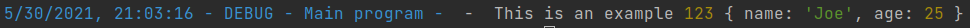
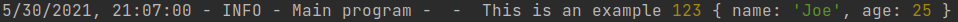
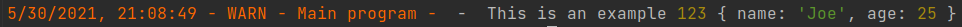
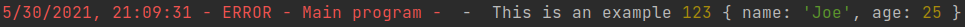

# ASK Logger

This is a simple Logger class for both NodeJS and Browser use.

It uses colours to easily distinguish message logging levels.

It is a work in progress.

## Installation
```shell
npm i ask-logger
```

## Usage

### debug
```typescript
const logger = Logger.getLogger('Main program')

logger.set_level(LogLevel.DEBUG)

logger.debug('This is an example', 123, {
    name: 'Joe',
    age: 25
})
```



### info

```typescript
const logger = Logger.getLogger('Main program')

logger.set_level(LogLevel.DEBUG)

logger.info('This is an example', 123, {
    name: 'Joe',
    age: 25
})
```



### warn

```typescript
const logger = Logger.getLogger('Main program')

logger.set_level(LogLevel.DEBUG)

logger.warn('This is an example', 123, {
    name: 'Joe',
    age: 25
})
```



### error

```typescript
const logger = Logger.getLogger('Main program')

logger.set_level(LogLevel.DEBUG)

logger.error('This is an example', 123, {
    name: 'Joe',
    age: 25
})
```



### no output

To prevent all output, simply set the logging level to LogLevel.NONE
```typescript
const logger = Logger.getLogger('Main program')

logger.set_level(LogLevel.NONE)

logger.error('This is an example', 123, {
    name: 'Joe',
    age: 25
})
```
